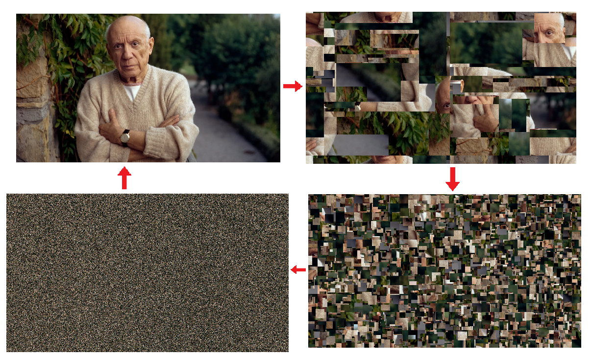
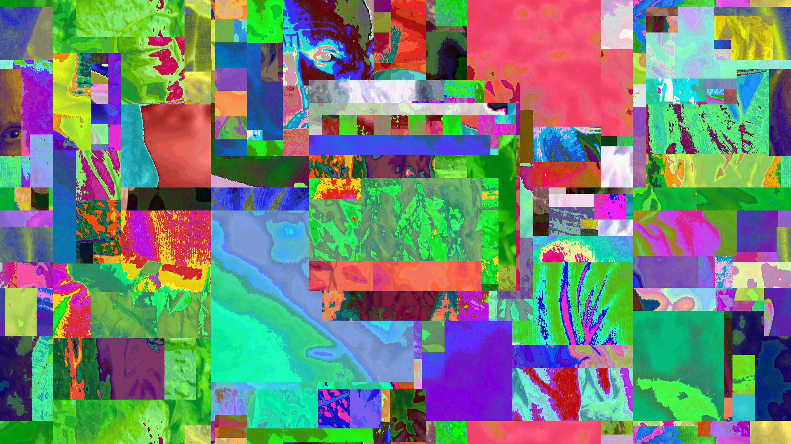

# Image Dicer

Hash an image into a cubist montage. This is also reversible. 

Can also be usd for image encryption.

Masking Feature

# How to Use

Windows: Compile and run with Windows tools (visual studio).

Linux: Compile this with Mono or MonoDevelop. Run mono 

# File Formats

Accepts Bmp, Jpg, Gif, Png formats. With Jpg compression there may be visual artifacts when decrypting.

# Options

*Key, xsize, ysize, mask, and iterations all need to be the same to successfully decrypt an image.*

Key = Set key to the value you want to unlock the image.

xsize/ysize = For encrypting an image set x = 1 y = 1 as the size parameter. For a cubism montage set this higher (1080 x 512)

iterations = This will go over the pixels multiple times for greater scrambling. I'd say set this max to 3 for encryption and 1 for montage.

mask = Randomly change the colors of the pixels. Increases security and looks kind of cool.

# TODO

Add an image resizer to scale down the output

Add a way to encrypt images that takes just a key (e.g. generate xsize ysize mask and iteration from the input key)

Command line arguments.
